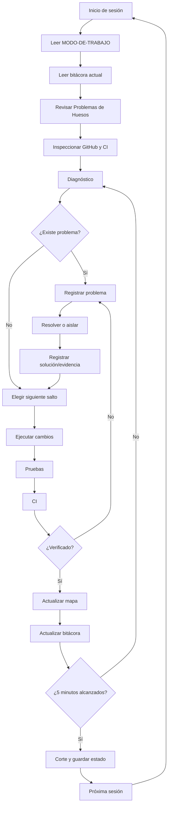

# Mapa de trabajo — AnimeArt

Este documento es el mapa vivo del trabajo. Debe actualizarse cuando cambie una fase, aparezca un bloqueo estructural o se complete un salto arquitectónico importante.

## Diagrama general



## Mapa de producto y arquitectura

```
AnimeArt
│
├── Android existente
│   ├── Document
│   ├── Layer
│   ├── Viewport
│   ├── Tools / Stroke
│   ├── Command History
│   ├── Renderer
│   └── Persistence
│
├── Web
│   ├── UI
│   ├── Domain
│   │   ├── Document
│   │   ├── Layer
│   │   ├── Stroke
│   │   └── Transform
│   ├── Renderer Canvas
│   ├── Persistence local
│   └── Tests / CI
│
└── Integración futura
    ├── Viewport Web
    ├── Zoom / Pan
    ├── Undo / Redo
    ├── Transformaciones completas
    ├── Persistencia de proyecto
    ├── PWA / Offline
    └── Contenedor Android
```

## Estado actual

- [x] Fundación Web
- [x] Canvas / Brush / Eraser
- [x] Capas y selección
- [x] Persistencia local
- [x] Migración de persistencia Web v1
- [x] Modelo Web Document/Layer
- [x] Tests del dominio
- [x] Android startup smoke test
- [x] Web CI
- [x] Android CI
- [ ] Viewport explícito en Web
- [ ] Separar cámara de transformación de Layer
- [ ] Zoom / Pan basado en Viewport
- [ ] Tests de coordenadas y transformaciones
- [ ] Undo / Redo por comandos
- [ ] Transformación completa de capas
- [ ] Persistencia de proyecto completa
- [ ] PWA / Offline
- [ ] Integración final Web/Android

## Próximo salto

**Viewport explícito + separación cámara/Layer + zoom/pan + tests de coordenadas.**

No avanzar a Undo/Redo hasta que este salto tenga evidencia de pruebas y CI.

## Regla

Este mapa describe intención y estado. La bitácora y GitHub contienen la evidencia de lo que realmente ocurrió.
